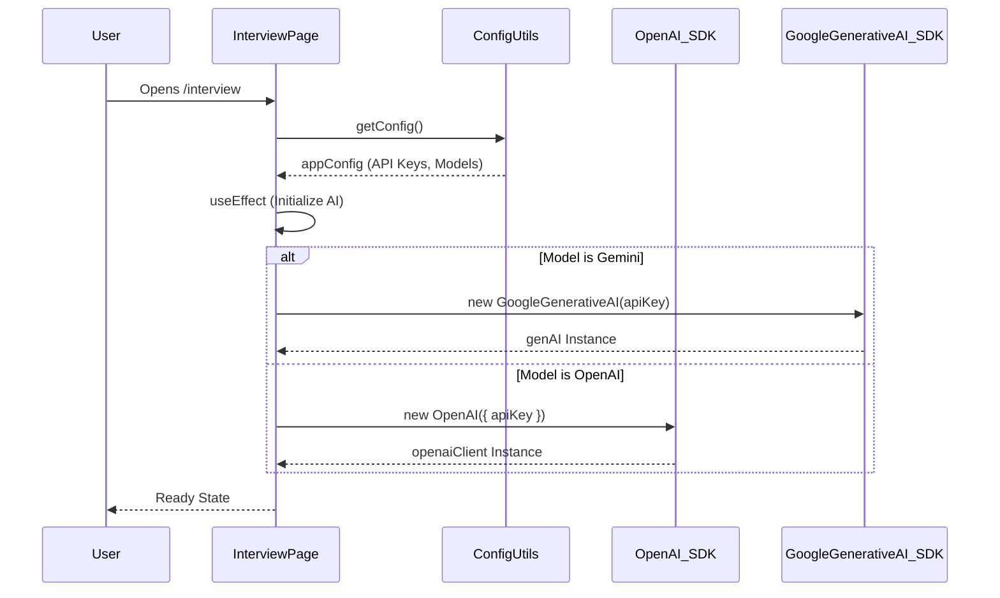
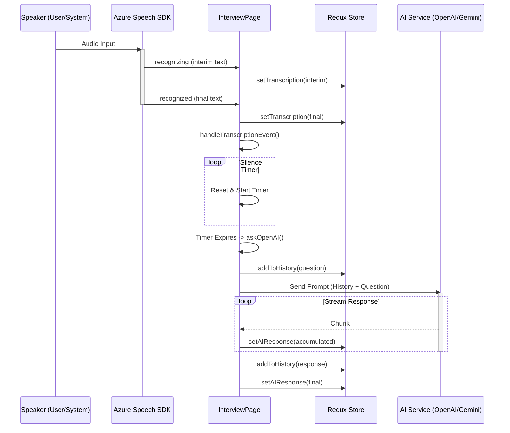
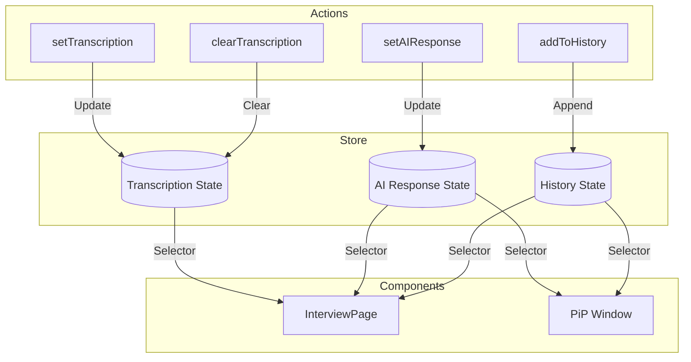
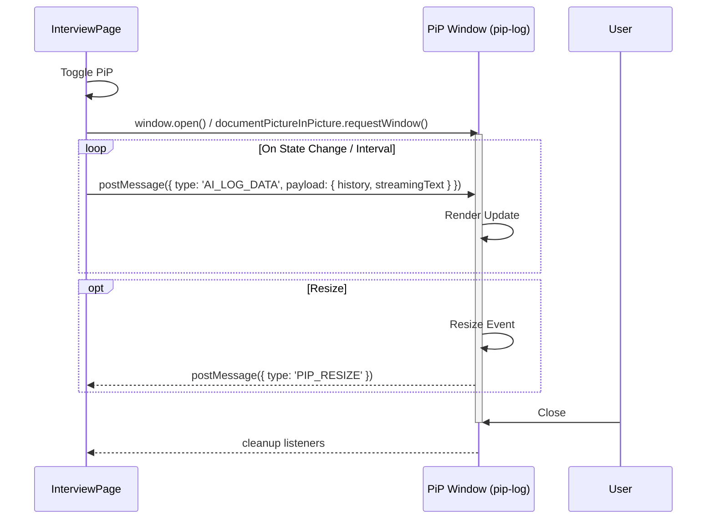

# Interview Copilot 🚀

## [aicopilot.chat](https://aicopilot.chat/)

An AI-powered interview assistant that provides real-time transcription and intelligent responses during technical interviews, now supporting both OpenAI and the latest Gemini models.

[](https://opensource.org/licenses/MIT)

## Features ✨

  - 🎙️ **Real-time Transcription**: High-accuracy voice-to-text for both the interviewer and candidate using Azure Cognitive Services.
  - 🤖 **AI-Powered Insights**: Get intelligent suggestions with conversational context awareness, powered by leading models from OpenAI and Google.
  - 🖼️ **Picture-in-Picture (PiP) Mode**: Keep an eye on the AI log in a separate, floating window so you can focus on the interview.
  - 💻 **Code Formatting**: Clear syntax highlighting for technical discussions makes code easy to read and understand.
  - ✨ **Enhanced UI**: A refreshed and more intuitive user interface for a seamless experience.
  - 🔄 **Latest AI Models**: Support for the newest models, including **Gemini 2.5 Pro** and **Gemini 2.5 Flash**.
  - 📚 **Question History**: Combine multiple questions from the history to ask the AI for a comprehensive analysis.
  - ⏱️ **Silence Detection**: Automatically submits recognized speech after a configurable period of silence for a smoother workflow.
  - ⚙️ **Highly Configurable**: Tailor AI models, API keys, response length, and system prompts to your exact needs.

## Technologies Used 🛠️

  - **Frontend**: React, Redux, Material-UI
  - **AI Services**: OpenAI GPT, Google Gemini, Azure Cognitive Services (Speech)
  - **Build Tools**: npm
  - **Other Libraries**: React Markdown, Highlight.js, Microsoft Cognitive Services Speech SDK

## System Architecture 🏗️

### Sequence Diagrams

#### 1. Application Initialization & AI Setup
This diagram shows how the `InterviewPage` initializes and sets up the AI client based on configuration.



#### 2. Audio Transcription & AI Response Flow
This diagram illustrates the core loop: Audio Capture -> Transcription -> Silence Detection -> AI Request.



### Flow Charts

#### 3. Redux State Management
Overview of how data flows through the Redux slices.



#### 4. Picture-in-Picture (PiP) Window Communication
How the main window synchronizes data with the PiP window.



## Getting Started 🚀

### Prerequisites

  - Node.js (v18+)
  - npm (v9+)
  - **OpenAI API key**: Get your key from [OpenAI](https://platform.openai.com/docs/overview).
  - **Gemini API key**: Get your key from [Google AI Studio](https://aistudio.google.com/app/apikey).
  - **Azure Speech Service key**: Get a free trial key from [Microsoft Azure](https://azure.microsoft.com/en-us/pricing/purchase-options/azure-account).

### Installation

1.  **Clone the repository**

    ```bash
    git clone https://github.com/hariiprasad/interviewcopilot.git
    cd interviewcopilot
    ```

2.  **Install dependencies**

    ```bash
    npm install
    ```

3.  **Run the development server**

    ```bash
    npm run dev
    ```

4.  **Access the application**
    Open your browser to `http://localhost:3000`

## Configuration ⚙️

1.  Open the **Settings** dialog (⚙️ icon in the header).
2.  Enter your API credentials:
      - OpenAI API Key (for OpenAI models)
      - Gemini API Key (for Gemini models)
      - Azure Speech Service Key
      - Azure Region
3.  Configure your preferences:
      - AI Model (Choose from OpenAI or Gemini models)
      - AI System Prompt
      - Auto-Submit & Manual modes
      - AI Response Length (concise, medium, lengthy)
      - Silence Timer Duration

## Usage 🖥️

### Main Interface Components

1.  **System Audio Panel (Left)**

      - Start/Stop system audio capture for the interviewer.
      - View and edit the transcribed questions.
      - Manage and combine questions from history.

2.  **AI Assistant Log (Center)**

      - View real-time AI responses.
      - Benefit from code formatting and syntax highlighting.
      - Access all previous response history.
      - Toggle auto-scroll and open the PiP window.

3.  **Your Mic Panel (Right)**

      - Start/Stop your microphone for candidate audio.
      - Toggle manual input mode.
      - Manually submit your responses to the AI.

## Troubleshooting 🛠️

**Common Issues:**

1.  **Audio Permissions**: Ensure your browser has microphone access. If permissions were denied, refresh the page and allow access when prompted.
2.  **API Errors**:
      - Double-check that your API keys in settings are correct.
      - Verify your internet connection.
      - Ensure the correct API key is provided for the selected AI model (e.g., Gemini key for Gemini models).
3.  **Transcription Issues**: For best results, speak clearly with minimal background noise and verify your Azure Speech Service subscription is active.

## Contributing 🤝

We welcome contributions\! Please follow these steps:

1.  Fork the repository.
2.  Create your feature branch (`git checkout -b feature/AmazingFeature`).
3.  Commit your changes (`git commit -m 'Add some AmazingFeature'`).
4.  Push to the branch (`git push origin feature/AmazingFeature`).
5.  Open a Pull Request.

## License 📄

This project is licensed under the MIT License.

## Acknowledgments 🙏

  - OpenAI for their GPT models.
  - Google for the Gemini models.
  - Microsoft Azure for Cognitive Services.
  - The Material-UI team and the broader React community for their fantastic tools.Of course\! Based on the new features like the enhanced UI, Picture-in-Picture (PiP) mode, and the addition of the latest Gemini models, here is an updated version of your `README.md` file.

-----

# Interview Copilot 🚀

## [aicopilot.chat](https://aicopilot.chat/)

An AI-powered interview assistant that provides real-time transcription and intelligent responses during technical interviews, now supporting both OpenAI and the latest Gemini models.

[](https://opensource.org/licenses/MIT)

## Features ✨

  - 🎙️ **Real-time Transcription**: High-accuracy voice-to-text for both the interviewer and candidate using Azure Cognitive Services.
  - 🤖 **AI-Powered Insights**: Get intelligent suggestions with conversational context awareness, powered by leading models from OpenAI and Google.
  - 🖼️ **Picture-in-Picture (PiP) Mode**: Keep an eye on the AI log in a separate, floating window so you can focus on the interview.
  - 💻 **Code Formatting**: Clear syntax highlighting for technical discussions makes code easy to read and understand.
  - ✨ **Enhanced UI**: A refreshed and more intuitive user interface for a seamless experience.
  - 🔄 **Latest AI Models**: Support for the newest models, including **Gemini 2.5 Pro** and **Gemini 2.5 Flash**.
  - 📚 **Question History**: Combine multiple questions from the history to ask the AI for a comprehensive analysis.
  - ⏱️ **Silence Detection**: Automatically submits recognized speech after a configurable period of silence for a smoother workflow.
  - ⚙️ **Highly Configurable**: Tailor AI models, API keys, response length, and system prompts to your exact needs.

## Technologies Used 🛠️

  - **Frontend**: React, Redux, Material-UI
  - **AI Services**: OpenAI GPT, Google Gemini, Azure Cognitive Services (Speech)
  - **Build Tools**: npm
  - **Other Libraries**: React Markdown, Highlight.js, Microsoft Cognitive Services Speech SDK

## Getting Started 🚀

### Prerequisites

  - Node.js (v18+)
  - npm (v9+)
  - **OpenAI API key**: Get your key from [OpenAI](https://platform.openai.com/docs/overview).
  - **Gemini API key**: Get your key from [Google AI Studio](https://aistudio.google.com/app/apikey).
  - **Azure Speech Service key**: Get a free trial key from [Microsoft Azure](https://azure.microsoft.com/en-us/pricing/purchase-options/azure-account).

### Installation

1.  **Clone the repository**

    ```bash
    git clone https://github.com/hariiprasad/interviewcopilot.git
    cd interviewcopilot
    ```

2.  **Install dependencies**

    ```bash
    npm install
    ```

3.  **Run the development server**

    ```bash
    npm run dev
    ```

4.  **Access the application**
    Open your browser to `http://localhost:3000`

## Configuration ⚙️

1.  Open the **Settings** dialog (⚙️ icon in the header).
2.  Enter your API credentials:
      - OpenAI API Key (for OpenAI models)
      - Gemini API Key (for Gemini models)
      - Azure Speech Service Key
      - Azure Region
3.  Configure your preferences:
      - AI Model (Choose from OpenAI or Gemini models)
      - AI System Prompt
      - Auto-Submit & Manual modes
      - AI Response Length (concise, medium, lengthy)
      - Silence Timer Duration

## Usage 🖥️

### Main Interface Components

1.  **System Audio Panel (Left)**

      - Start/Stop system audio capture for the interviewer.
      - View and edit the transcribed questions.
      - Manage and combine questions from history.

2.  **AI Assistant Log (Center)**

      - View real-time AI responses.
      - Benefit from code formatting and syntax highlighting.
      - Access all previous response history.
      - Toggle auto-scroll and open the PiP window.

3.  **Your Mic Panel (Right)**

      - Start/Stop your microphone for candidate audio.
      - Toggle manual input mode.
      - Manually submit your responses to the AI.

## Troubleshooting 🛠️

**Common Issues:**

1.  **Audio Permissions**: Ensure your browser has microphone access. If permissions were denied, refresh the page and allow access when prompted.
2.  **API Errors**:
      - Double-check that your API keys in settings are correct.
      - Verify your internet connection.
      - Ensure the correct API key is provided for the selected AI model (e.g., Gemini key for Gemini models).
3.  **Transcription Issues**: For best results, speak clearly with minimal background noise and verify your Azure Speech Service subscription is active.

## Contributing 🤝

We welcome contributions\! Please follow these steps:

1.  Fork the repository.
2.  Create your feature branch (`git checkout -b feature/AmazingFeature`).
3.  Commit your changes (`git commit -m 'Add some AmazingFeature'`).
4.  Push to the branch (`git push origin feature/AmazingFeature`).
5.  Open a Pull Request.

## License 📄

This project is licensed under the MIT License.

## Acknowledgments 🙏

  - OpenAI for their GPT models.
  - Google for the Gemini models.
  - Microsoft Azure for Cognitive Services.
  - The Material-UI team and the broader React community for their fantastic tools.
